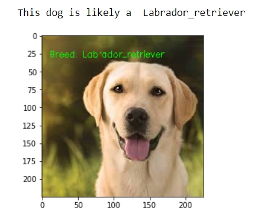
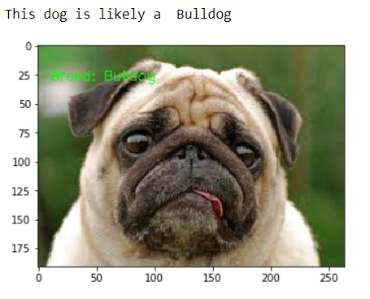
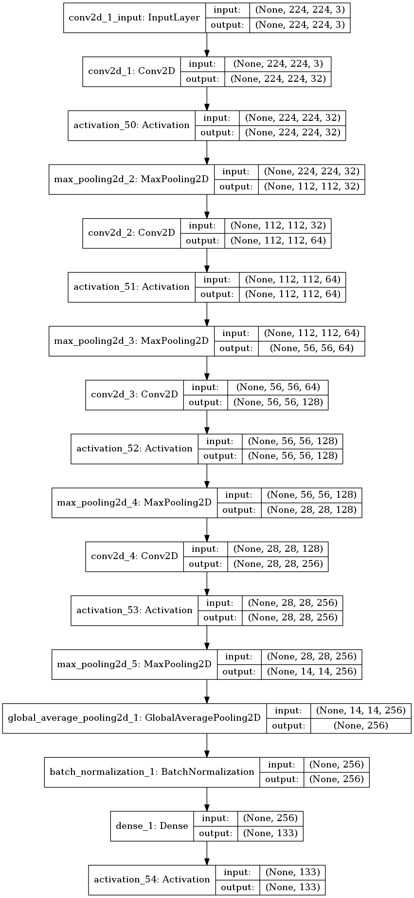

# Dog Breed Classifier Project
> 
The motivation behind this project is to build a classification algorithm that predicts the breed of a given dog.The classification algorithm accepts a file path to an image and first determines whether the image contains a human, dog, or neither. Then,
* if a dog is detected in the image, return the predicted breed.
* if a human is detected in the image, return the resembling dog breed.
* if neither is detected in the image, provide output that indicates an error.

This project is also featured on the Medium website @ [link](https://medium.com/@charlesmodingwa/dog-breed-classification-project-using-cnns-fe35d2a065f9)
## Table of contents
* [Data and Code](#data-and-code)
* [Prerequisites](#prerequisites)
* [Instructions on running the application](#instructions-on-running-the-application)

## Summary of the results
The algorithm uses a pre-trained InceptionV3 CNN to predict the image of a given dog within a reasonable level of accuracy.The model achieves an accuracy of around 78% in classifying 133 dog breeds.  When given an image path the algorithm returns results in this format:
* 
* 

Below is an architecture of the custom CNN that was developed during the project.

## Data and Code
* The main application is contained in the dog_app.ipynb jupyter notebook. All the functions and code, as well as the rationale behind decisions taken is contained in this notebook.
* Test images are in the images folder in the root directory.
* The main data set was provided by Udacity and can be accessed here:
    * [Dog dataset](https://s3-us-west-1.amazonaws.com/udacity-aind/dog-project/dogImages.zip)
    * [Human_dataset](https://s3-us-west-1.amazonaws.com/udacity-aind/dog-project/lfw.zi)
## Prerequisites
* Numpy
* Sklearn
* Sqlalchemy
* Pickle
* keras
* cv2
* glob
* seaborn
* os
* Matplotlib
* Pillow
Jupyter notebook and python 3.6 are needed to run the notebooks and python scripts.

## Instructions on running the application
1. Download the required data sets and if required modify the directory paths.
2. Access to a GPU is essential in training the models.
